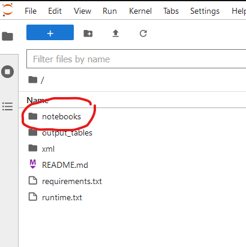
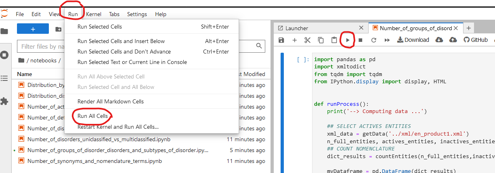

# Binder/Docker for Jupyter Notebook Orphanet Nomenclature

## Executing program
Click below to run Binder

## Running Scripts

In order to run various scripts:
- please navigate in notebooks directory:

- open one by double-click.
- run it by selecting run all cells in Menu OR click the dedicated button OR type SHIFT+ENTER

## Authors

Contributors names and contact info
David Lagorce 
[@david.lagorce@inserm.fr]

